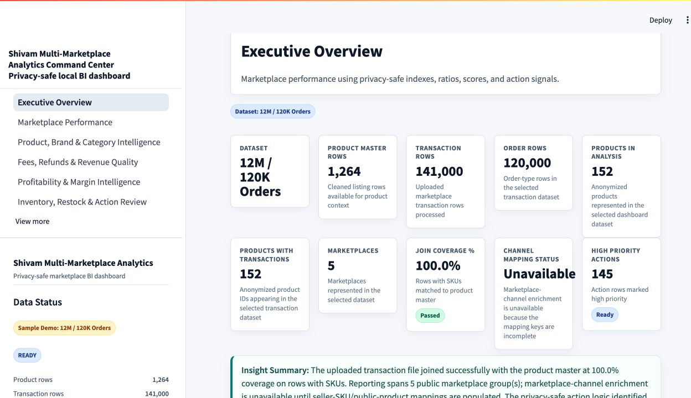
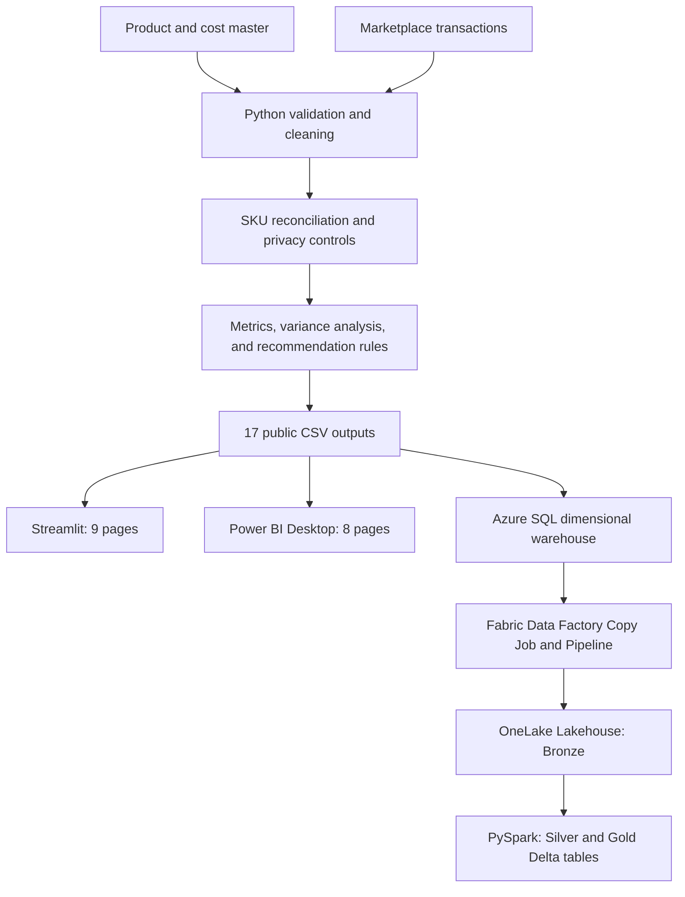
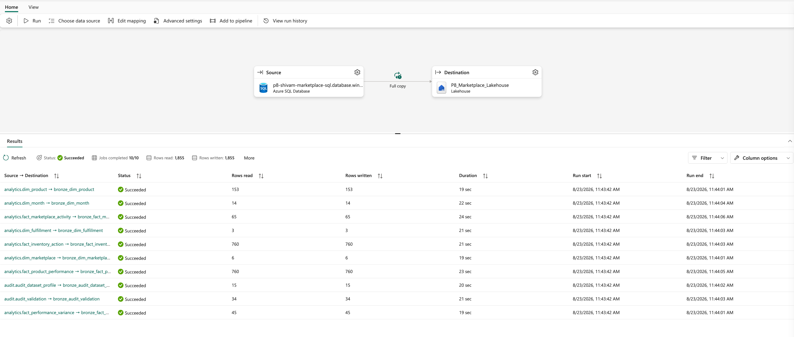
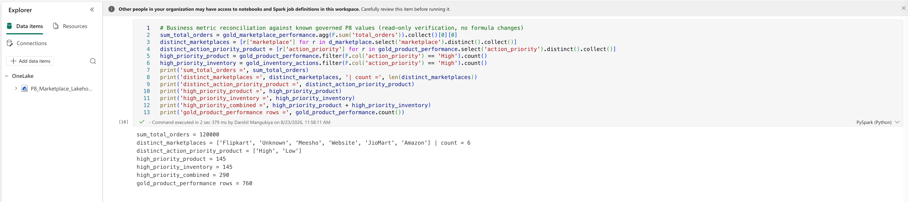
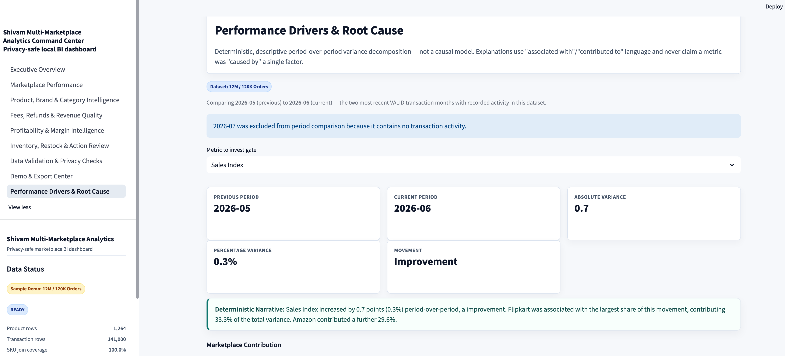
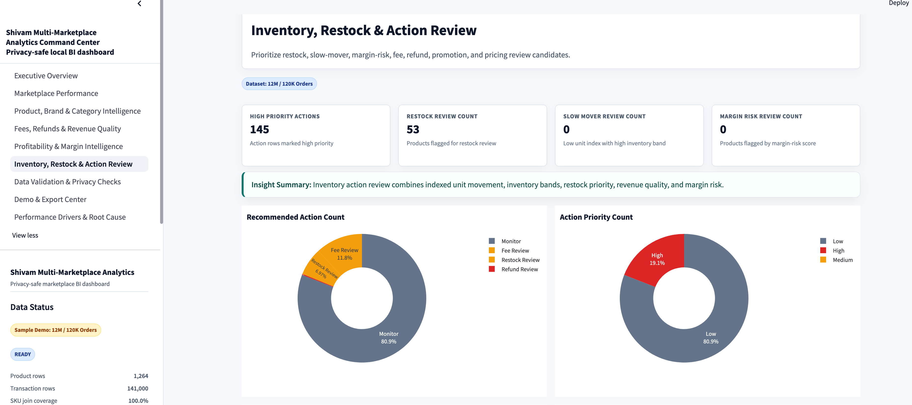
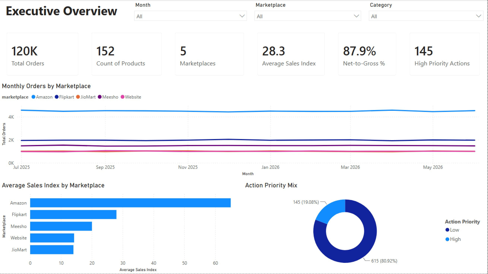

# Shivam Multi-Marketplace Analytics Command Center

This project turns marketplace transaction exports and a product/cost master into privacy-safe analytics for marketplace, product, fee, refund, promotion, profitability, and inventory review.

The Python pipeline validates and joins the source files, removes private identifiers, calculates reusable metrics, and writes 17 public CSV outputs. Streamlit and Power BI Desktop provide two reporting experiences over those outputs. Azure SQL Database hosts a dimensional warehouse, and Microsoft Fabric ingests the warehouse into a OneLake Lakehouse for Bronze, Silver, and Gold processing.

[](https://github.com/darshil-mangukiya/shivam-marketplace-analytics-command-center/actions/workflows/ci.yml)    

  

    

<p align="center">
  
</p>

## System overview



The Streamlit app and Power BI report read the public CSV layer. Fabric is a separate cloud analytics path sourced from Azure SQL.

## Analytics

The 17 public outputs cover:

- marketplace and product performance using sales and unit indexes;
- brand, category, fulfillment, fee, refund, and promotion analysis;
- estimated profitability, margin risk, and revenue-quality signals;
- restock, slow-mover, pricing, fee, refund, and promotion review actions;
- descriptive period-over-period contribution analysis by marketplace and product;
- output profiles and validation results.

Eight ordered recommendation rules produce product and inventory action queues. The checked-in output set contains 145 high-priority product actions and 145 high-priority inventory actions. The local workflow module tracks 290 combined exceptions through a validated status lifecycle and append-only action log.

Marketplace-channel enrichment is unavailable because its mapping keys are incomplete. Marketplace-level analysis and the SKU-to-product join remain available.

## Data controls

The public layer replaces private product identifiers with `public_product_id`, groups descriptive attributes, converts financial amounts to indexes or ratios, and excludes raw order, product, location, and financial fields.

Controls run at several points:

- two YAML contracts validate uploaded source files;
- six YAML contracts validate the main public outputs;
- schema and regression tests cover the other public outputs;
- a full-frame content scan checks every public cell for sensitive patterns;
- rejected rows use a quarantine record containing safe metadata only;
- KPI metadata in `shared/kpi_registry.py` checks field presence, ranges, and public classification.

See [Data Privacy Guide](docs/DATA_PRIVACY_GUIDE.md), [data contracts](contracts/), and [KPI catalog](docs/kpi_catalog.md).

## Azure SQL Database

The Azure SQL implementation contains:

- 4 dimensions, including reserved `Unknown` members;
- 4 fact tables and 2 audit tables;
- 7 reporting views;
- 10 primary keys, 9 foreign keys, and 8 nonclustered indexes.

`shared/sqlserver_star_schema.py` reshapes the public marts into deterministic dimensional tables. `shared/sqlserver_loader.py` loads them transactionally with dependency-aware clearing and source-to-target reconciliation. The validated Azure SQL run loaded all 10 tables with zero row-count differences and zero orphaned foreign keys. Warehouse totals reconcile to 120,000 orders, 760 product-performance rows, and 145 high-priority inventory actions.

The loader supports Microsoft `mssql-python` for Azure SQL and optional `pyodbc` connectivity. Credentials are read from environment variables.

Implementation details and run results:

- [Azure SQL model](docs/sql_server_reporting_model.md)
- [Azure SQL runtime record](docs/evidence/azure_sql_runtime_evidence.md)
- [T-SQL](sql/sqlserver/)

## Microsoft Fabric

Fabric Data Factory copies 10 Azure SQL tables into `P8_Marketplace_Lakehouse`. The latest validated Copy Job reconciles 1,855 source rows with 1,855 Bronze rows. A PySpark notebook trims and validates the Bronze data, checks keys and duplicates, and writes Silver and Gold tables in Delta format.

| Layer | Tables | Result |
|---|---:|---|
| Bronze | 10 | 1,855 rows reconciled to Azure SQL |
| Silver | 10 | 0 null keys and 0 duplicate-key drops |
| Gold | 5 | Marketplace, product, inventory, variance, and validation marts |
| Total | 25 | All passed `DeltaTable.isDeltaTable()` validation |

Fabric refreshes use deterministic full-table overwrite. A controlled invalid-table run exercised the configured retry behavior; correcting the source reference produced a successful recovery with the original row count.

See the [Fabric runtime record](docs/evidence/fabric_runtime_evidence.md) and [reconciliation artifacts](artifacts/fabric/).

<p align="center">
  
</p>

<p align="center">
  
</p>

## Reporting

### Streamlit

The 9-page app supports a two-file upload workflow and a sample-data mode. Pages cover executive metrics, marketplace performance, product intelligence, revenue quality, profitability, inventory actions, validation, exports, and performance drivers.

<p align="center">
  
</p>

<p align="center">
  
</p>

### Power BI Desktop

The checked-in `.pbix` contains 8 pages and 26 documented DAX measures. It imports six public CSVs and covers executive, marketplace, product/category, fees/promotions, profitability, inventory, action, and validation views.

<p align="center">
  
</p>

See [Power BI documentation](dashboards/powerbi/README.md), [data model](dashboards/powerbi/data_model.md), and [DAX measures](dashboards/powerbi/dax_measures.md).

## Business analysis

The repository includes a BRD, functional and non-functional requirements, user stories, Given/When/Then acceptance criteria, MoSCoW prioritization, As-Is and To-Be processes, gap analysis, risk and decision logs, defect tracking, source-to-target mapping, and requirements traceability.

The current catalog contains 25 requirements, 23 user stories, and 33 passing UAT scenarios. Requirements are modeled from the implemented workflow and available data, and trace to code, outputs, tests, or UAT cases.

See [business analysis artifacts](business_analysis/) and [UAT results](docs/uat/uat_execution_results.csv).

## Validation

The technical checks cover application behavior, data contracts, privacy, output schemas, metrics, variance logic, workflow transitions, SQL transformations, and loader behavior.

```bash
python -m pytest
python python/run_privacy_scan.py
make validate
```

Runtime records:

- [Testing](docs/evidence/testing_evidence.md)
- [Privacy](docs/evidence/privacy_evidence.md)
- [UAT](docs/evidence/uat_evidence.md)
- [Dependency security](docs/evidence/dependency_security_evidence.md)

## Quick start

```bash
git clone https://github.com/darshil-mangukiya/shivam-marketplace-analytics-command-center.git
cd shivam-marketplace-analytics-command-center
python -m venv .venv
source .venv/bin/activate
pip install -r requirements.txt
streamlit run app/streamlit_app.py
```

The app opens in upload mode and accepts a product/cost/channel workbook plus a marketplace transaction CSV. Select Sample Demo in the sidebar to explore the checked-in public outputs.

Run the local pipeline with private source files stored in the ignored `data/private_raw/` directory:

```bash
make run-12m
```

Azure SQL loading is optional and uses the settings documented in `.env.example`.

## Repository structure

```text
.
├── .github/workflows/      # Continuous integration
├── app/                    # Streamlit application and screenshots
├── artifacts/              # SQL, Fabric, and workflow reconciliation output
├── business_analysis/      # Requirements and process artifacts
├── contracts/              # Upload and public-output YAML contracts
├── dashboards/powerbi/     # PBIX, screenshots, model, and DAX documentation
├── data/public/            # 17 public analytical CSV outputs
├── docs/                   # Architecture, operation, evidence, and UAT documentation
├── governance/             # Business glossary
├── python/                 # Pipeline and maintenance entry points
├── shared/                 # Metrics, contracts, privacy, SQL, variance, and workflow logic
├── sql/                    # Analytical SQL and Azure SQL warehouse scripts
└── tests/                  # Functional and data-quality tests
```

## Implementation scope

Power BI Desktop reads the public CSV outputs. Microsoft Fabric reads the Azure SQL warehouse through a separate medallion path. Profitability metrics are directional estimates based on the available cost and fee fields; they are suitable for prioritization and comparison.

## License

This project is licensed under the [MIT License](LICENSE).
