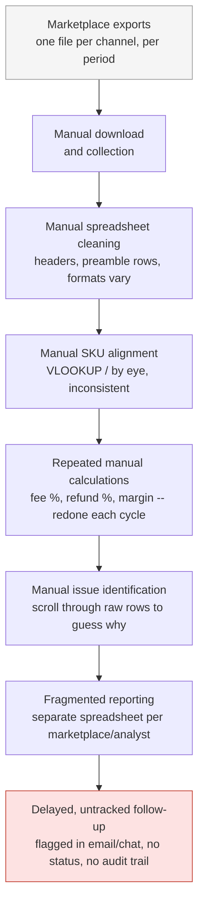

# As-Is Process: Marketplace Reporting (Modeled Baseline)

This models a realistic pre-project state for a multi-marketplace seller
team — not Shivam's actual historical process, which was never observed
firsthand. It is the baseline the To-Be process (see
[`to_be_marketplace_reporting.md`](to_be_marketplace_reporting.md)) is
designed to improve on.

## Narrative

Each marketplace (Amazon, Flipkart, Meesho, Myntra, Ajio-style channel)
produces its own settlement/transaction export, in its own layout, on its
own schedule. An analyst downloads each file manually, opens it in Excel,
and manually cleans headers, strips preamble rows, and standardizes
column names — a process that has to be redone by hand every time a
marketplace changes its export format. SKUs are matched to the product
master by eye or with brittle VLOOKUPs, with no consistent handling for
non-product settlement lines (fees, refunds, adjustments) — these are
often just deleted or ignored, silently losing information. Fee/refund/
margin percentages are recalculated from scratch in a new spreadsheet each
reporting cycle, so formulas can drift between cycles without anyone
noticing. When a marketplace's numbers look off, someone has to manually
scroll through raw rows to guess why — there is no repeatable root-cause
method, so period-over-period narratives are anecdotal. Issues that are
found (a fee spike, a refund spike, a stockout risk) get flagged in an
email or a chat message, with no consistent status or record of whether
anyone actually followed up.

## Diagram

## Pain points (mapped to what this project addresses)

| Pain point | Consequence | Addressed by |
|---|---|---|
| Manual header/format cleaning per marketplace | Slow, error-prone, breaks silently on format drift | `app/utils/transaction_cleaner.py` header/alias detection + `shared/contracts.py` |
| Inconsistent SKU alignment, non-product rows dropped | Undercounts real activity, loses fee/refund context | `app/utils/joiner.py` (`NON_PRODUCT_ACTIVITY` handling) |
| Recalculated formulas drift between cycles | Numbers become untrustworthy over time | `shared/metrics.py`, `shared/profitability.py`, `docs/kpi_catalog.md` (single source of formula truth) |
| No repeatable root-cause method | Anecdotal, inconsistent explanations; risk of causal overclaiming | `shared/variance_engine.py` (deterministic, non-causal) |
| Fragmented per-marketplace reporting | No single comparable view | 17 governed public outputs, Streamlit + Power BI over the same data |
| Untracked follow-up on flagged issues | Issues are raised without a shared status | `shared/workflow.py` exception queue and action log |
