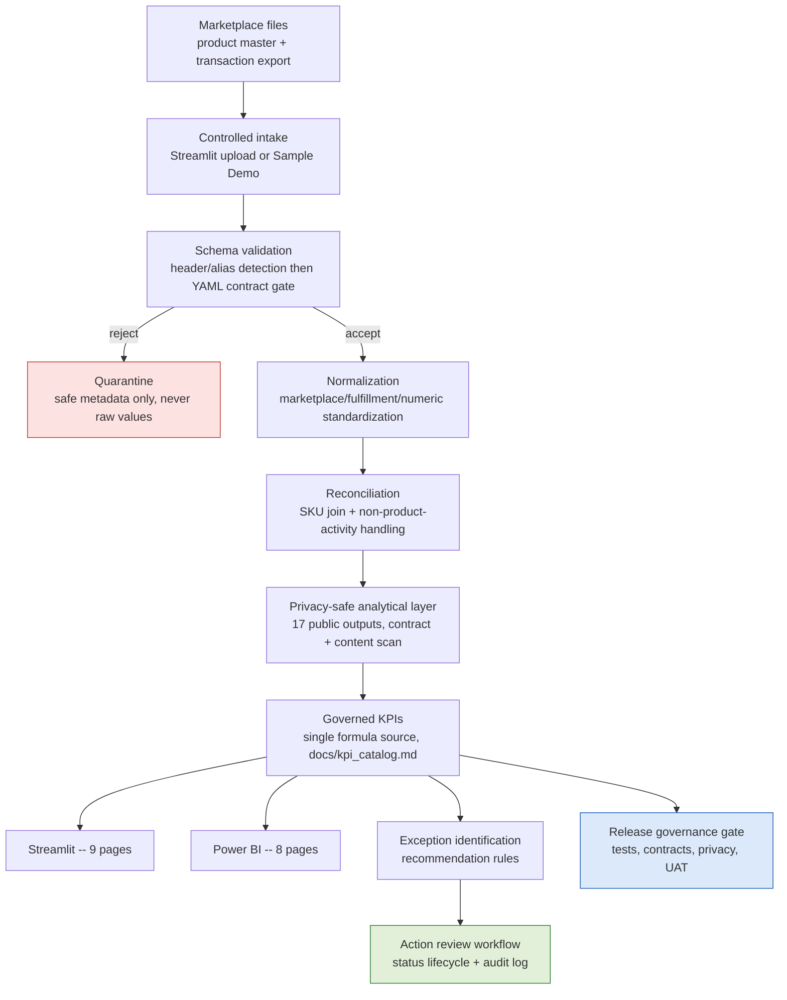

# To-Be Process: Marketplace Reporting (Implemented in P8)

This describes what is **actually implemented and running** in this
repository today — not an aspirational future state. Every stage below
cites the real module or artifact that performs it.

## Narrative

Marketplace files (product/cost/channel master + transaction export) enter
through a **controlled intake** — either a real file upload in the
Streamlit app or the Sample Demo path. Every file passes **schema
validation** (header/alias detection, then a declarative YAML contract as
an additional gate) before any of its data can influence downstream
output; rows that fail are **quarantined** with safe metadata, never
silently dropped or exposed. Accepted data is **normalized** (marketplace
names, fulfillment types, numeric fields) and **reconciled** against the
product master, with non-product settlement lines explicitly preserved
via a `NON_PRODUCT_ACTIVITY` sentinel rather than discarded. The
reconciled data feeds a **privacy-safe analytical layer** (17 public
outputs, each contract-checked where declared, all content-scanned before
publication) that computes **governed KPIs** from a single formula source
(`shared/metrics.py`, `shared/profitability.py`, documented in
`docs/kpi_catalog.md`). Those governed outputs power two **BI surfaces**
(the 9-page Streamlit app and the 8-page Power BI report) over the same
data. A dedicated **exception identification** layer
(`shared/recommendations.py`) flags high-priority conditions (restock,
fee review, refund review, margin risk), which the new **action review**
workflow (`shared/workflow.py`) turns into a **tracked decision** with an
explicit status lifecycle and an append-only audit log. A documented
**release governance** gate (`docs/bi/release_governance.md`) defines what
must pass — tests, contracts, privacy, reconciliation, critical UAT —
before a change is considered ready.

## Diagram

## To-Be capability map

| To-Be capability | Implementation | Status |
|---|---|---|
| Controlled intake | `app/streamlit_app.py`, `app/utils/product_master_loader.py`, `app/utils/transaction_cleaner.py` | Implemented, tested |
| Schema validation | `shared/contracts.py`, `contracts/*.yml` | Implemented, live-integrated, 8/8 contracts (2 upload + 6 public-output) |
| Quarantine | `shared/quarantine.py` | Implemented, live-integrated |
| Normalization | `app/utils/transaction_cleaner.py`, `python/pipeline_utils.py` | Implemented, tested |
| Reconciliation | `app/utils/joiner.py` | Implemented, tested |
| Privacy-safe analytical layer | `shared/public_output_builder.py`, `shared/privacy.py` | Implemented, tested, privacy-scanned |
| Governed BI (dual surface) | Streamlit (9 pages) + Power BI (8 pages, CSV mode) | Implemented; PBIX preserved, not rebuilt |
| Exception identification | `shared/recommendations.py` | Implemented, tested |
| Action review / tracked decision | `shared/workflow.py` | Implemented, tested |
| Release checks | `docs/bi/release_governance.md` | Documented validation gate |
