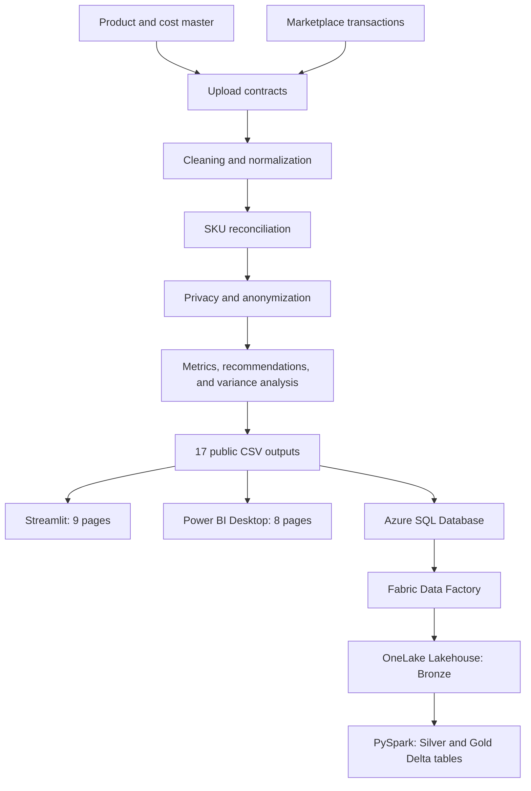
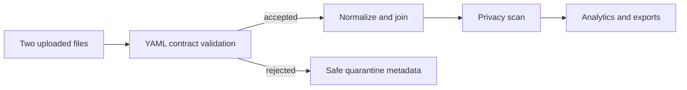
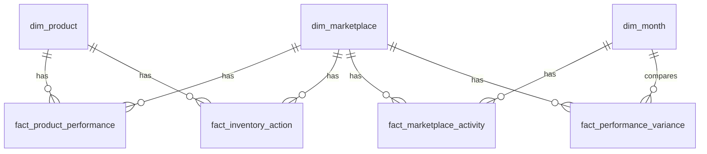
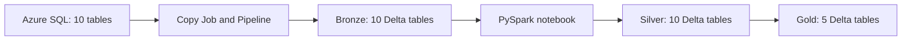

# System Architecture

## Data flow

The Python path is the source of the public analytical layer. Streamlit and Power BI read that layer directly. Azure SQL reshapes the same outputs into a dimensional model. Fabric copies the 10 Azure SQL tables into OneLake and produces 10 Bronze, 10 Silver, and 5 Gold tables.

## Upload processing

Uploaded files use temporary local storage for processing. Public frames pass column and full-content privacy scans before the application stores or exports them.

## Azure SQL model

The warehouse uses deterministic surrogate keys and a reserved `Unknown` member in every dimension. Foreign keys and row-count reconciliation protect the load.

## Fabric medallion path

Fabric refreshes use full-table overwrite. Reconciliation, key checks, duplicate checks, Delta validation, retry, and recovery results are recorded in [Fabric runtime evidence](../evidence/fabric_runtime_evidence.md).
